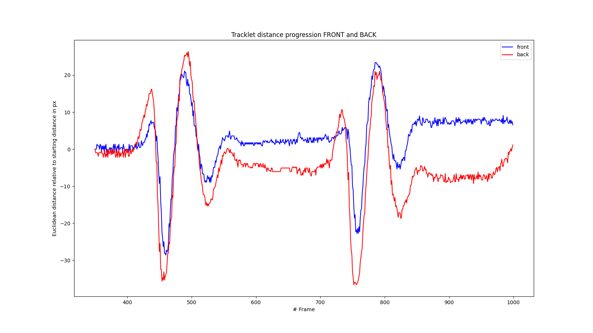

# bike-suspension-analyzer

Analyze suspension of a (moto)bikes.

## Demo Results




## Requirements

``Python3`` (>=3.7) and ``ffmpeg`` must be installed on system.

## Setup

```bash
python3 -m venv .venv
source ./.venv/bin/activate
pip install -r requirements.txt

python3 run.py path/to/video
```


